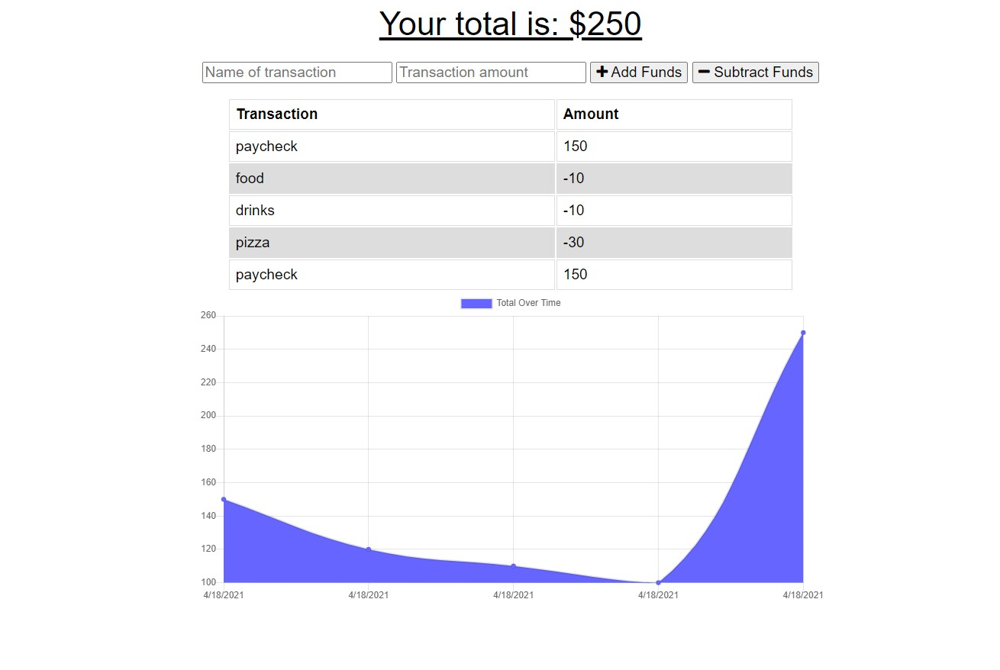

# Budget Tracker PWA
A PWA Budget Tracker using MongoDB

## Description
This is a PWA budget tracking app which uses MongoDB. It allows for the input of additions and subtractions which are then displayed in a simple ledger and a graph. 

The use of indexedDB allows for entries to be made without an internet connection which are then added to database when connection is restored. 

A Service Worker also allows for offline use by caching the elements of the page when first loaded.

The inclusion of a manifest.json file also allows for it to be installed as a standalone app.

## Table of Contents
* [Installation](#Installation)
* [Usage](#Usage)
* [Technologies](#Technologies)
* [Preview](#Preview)

## Installation
No installation is necessary as the app is deployed to heroku. However as noted in the description after visiting the site it can be installed as a standalone app.

## Usage
App is on Heroku at https://agile-shelf-76256.herokuapp.com/

## Technologies
This application was made using

 
with the following npm packages
* `express.js`
* `mongoose`
* `compression`
* `morgan` 

## Preview

### Screenshot

